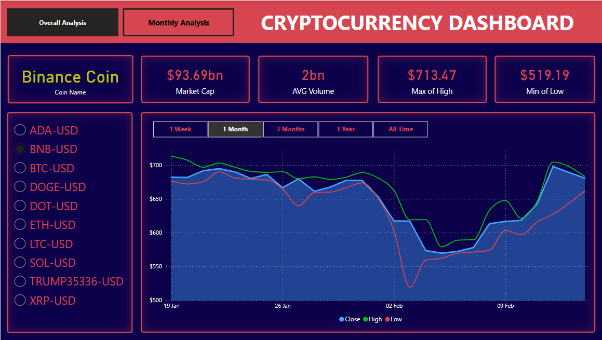
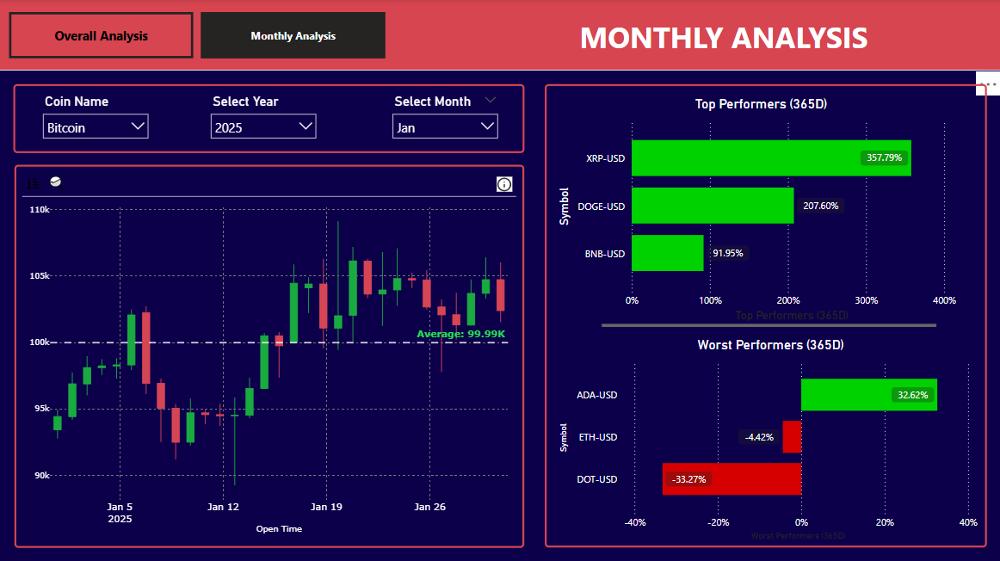

# 📊 Crypto Currency Data Analysis  

A **Power BI** dashboard for **cryptocurrency analysis**, leveraging the **Yahoo Finance Python package** for data collection and **Pandas** for structuring and cleaning. The dashboard provides insights into various cryptocurrencies, including market trends, performance analysis, and historical price movements.

---

## 🚀 Features  
- 📈 **Real-time & historical data** collection using Yahoo Finance API  
- 🧹 **Data cleaning & structuring** with Pandas  
- 📊 **Interactive Power BI dashboards** for visualizing key metrics  
- 🔍 **Comparison of multiple cryptocurrencies** with dynamic filtering  
- 📉 **Candlestick charts, line graphs, and statistical indicators**  

## 📊 Dashboard Preview  
Below is a preview of the Power BI dashboard created for analyzing cryptocurrency data:

## 📌 Technologies Used  
- **Python** 🐍  
  - `yfinance` (Yahoo Finance API)  
  - `pandas` (Data Cleaning & Structuring)  
  - `matplotlib` (Data Visualization)  
- **Power BI** 📊 (Dashboard visualization)  
- **Jupyter Notebook** 📒 (For data preprocessing)  

---

## 📥 Installation  
### 🔧 Prerequisites  
Ensure you have:  
✅ **Python 3.x** installed  
✅ **Power BI Desktop** installed  

